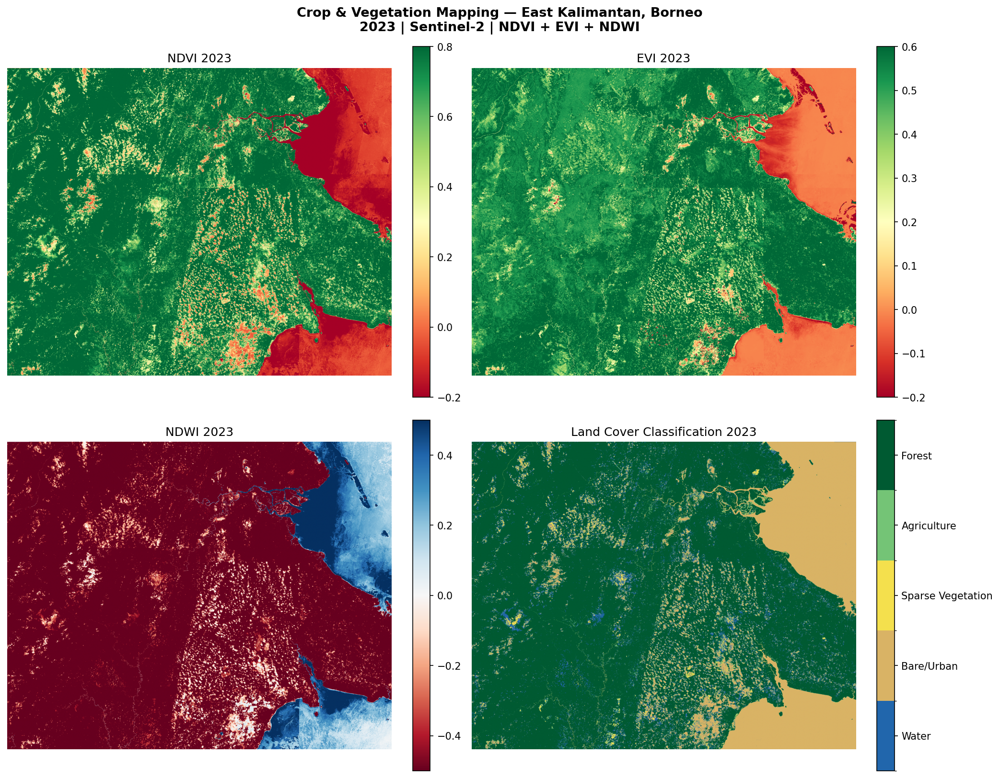

# Crop, Water, Vegetation Mapping - East Kalimantan, Borneo Region

Detailed land cover classification of the East Kalimantan, Borneo region using multiple spectral indices from Sentinal-2
satellite imagery.

## Study Area and Year

- **Region:** East Kalimantan, Indonesion Borneo (ROI: 116°E–118.5°E, 0.5°N–2.5°N)
- **Year:** 2023
- **I used the same region as the land use change project:** Allows direct cross-referencing of classification results
with 2017-2023 change detection analysis.

## Difference from Land use change detection

The land use change detection compared two snapshots from two years 2017 and 2023 using only NDVI.
This project does land cover classification of a specific year 2023 using three spectral indices combined:
- **NDVI** alone cannot reliably separate water from bare soil, or agriculture from sparse forest.
- **EVI** improves accuracy in dense vegetated areas where NDVI saturates.
- **NDWI** reliably separates water areas from all the vegetation types.

## Methodology
1. **Data:** Sentinel-2 Surface Reflectance (COPERNICUS/S2_SR_HARMONIZED) via GEE
2. **Cloud masking:** QA60 band — removes cloud and cirrus pixels
3. **Compositing:** Annual median composite (84 images) for 2023
4. **Spectral Indices Computed:**
   - NDVI = (B8 - B4) / (B8 + B4) — vegetation density
   - EVI = 2.5 × (B8 - B4) / (B8 + 6×B4 - 7.5×B2 + 1) — canopy structure
   - NDWI = (B3 - B8) / (B3 + B8) — water detection
5. **Classification:** Multi-index threshold mapping into 5 classes:
   - Water (NDWI > 0.1)
   - Bare / Urban (NDWI ≤ 0.1, NDVI < 0.15)
   - Sparse Vegetation (NDVI 0.15–0.35)
   - Agriculture / Plantation (NDVI 0.35–0.6, EVI < 0.35)
   - Dense Forest (NDVI > 0.6, EVI ≥ 0.35)

## Results



| Class | Coverage 2023 |
|---|---|
| Water | 7.3% |
| Bare / Urban | 17.6% |
| Sparse Vegetation | 3.6% |
| Agriculture | 1.3% |
| Forest | 70.2% |

Forest still dominates the interior at 70.2%. The 17.6% bare/urban 
classification is consistent with cleared land and coastal settlements 
visible in the NDWI map.

## three indices instead of one

| Index | Strength | Limitation |
|---|---|---|
| NDVI | Good general vegetation measure | Saturates in dense forest, poor water separation |
| EVI | Better in dense canopy, reduces atmospheric noise | More complex, needs Blue band |
| NDWI | Reliable water detection | Only useful for water/non-water separation |

Combined, the three indices produce a more accurate classification than any single index alone.

## Tools & Libraries

- Python 3.12
- Google Earth Engine API (`earthengine-api`)
- `geemap`, `rasterio`, `numpy`, `matplotlib`

## How to Run

```bash
# Step 1 — download and process data
# Set TRAIN = True in main.py, then:
python main.py

# Step 2 — visualize results
# Set TRAIN = False in main.py, then:
python main.py
```

## References

- Huete et al. (2002) — Overview of the radiometric and biophysical performance of EVI
- Gao (1996) — NDWI: A normalized difference water index for remote sensing of vegetation
- Sentinel-2 Mission Guide — ESA

